# Invoice OCR

AI-powered Invoice OCR Agent for ERPNext powered by DeepInfra.

Invoice OCR automatically extracts structured invoice data from images and PDFs using advanced AI models, validates financial totals, matches suppliers intelligently, and creates Purchase Invoices inside ERPNext.

---

## 🧭 How It Works

1. User uploads invoice (Image or PDF)
2. AI extracts structured data using DeepInfra models
3. System validates totals and tax calculations
4. Supplier is matched automatically
5. User reviews extracted data
6. Purchase Invoice is generated inside ERPNext

Processing runs in background using Frappe background jobs for better performance.

---

## 🚀 Features

### 📸 Smart Invoice Capture
- Upload PNG, JPG, JPEG, or PDF invoices
- Mobile camera support
- Secure private file storage

### 🧠 AI-Powered OCR
- Vision model for image invoices
- Text model for structured extraction
- Layout-aware parsing
- Context-aware extraction

### 🤖 Intelligent Data Extraction
- Invoice Number
- Invoice Date
- Supplier Name
- Line Items (Qty, Rate, Amount)
- VAT / Tax detection
- Currency detection

### 🔎 Supplier Matching Engine
- Intelligent fuzzy matching
- ERP Supplier auto-mapping
- Manual fallback supported

### 💰 Financial Validation Engine
- Net total calculation
- Tax validation
- Grand total reconciliation
- Risk scoring (LOW / MEDIUM / HIGH)
- Mismatch detection

### 📊 Semantic JSON Output
- Normalized structured AI output
- Stored for audit and debugging

### 🧾 Auto Purchase Invoice Creation
- One-click Purchase Invoice generation
- Expense account auto-detection
- Tax account auto-mapping
- Duplicate protection

### ⚙ Background Processing
- Uses Frappe background jobs
- Non-blocking UI
- Live processing status polling

---

## 🏗 Architecture Overview

Invoice OCR uses a modular AI pipeline:

1. Vision OCR Agent  
2. Layout Detection Agent  
3. Context Builder  
4. Header Extraction Agent  
5. Line Item Extraction Agent  
6. Tax Detection Agent  
7. Financial Validator  
8. Supplier Intelligence Engine  

All AI processing is powered by DeepInfra models.

---

## 🔐 Configuration (Required)

Before using the app:

1. Install the app  
2. Open **DeepInfra Settings**  
3. Enter your DeepInfra API Key  
4. Save  

The API key is securely stored in a Password field and never hardcoded.

---

## 📦 Installation

Using Bench CLI:

```bash
cd $PATH_TO_YOUR_BENCH
bench get-app https://github.com/Zikpro/invoice-ocr-ai
bench install-app invoice_ocr
bench migrate
bench restart


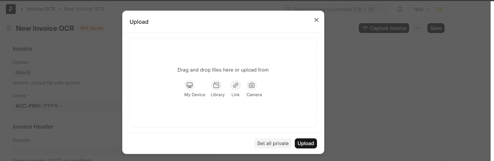
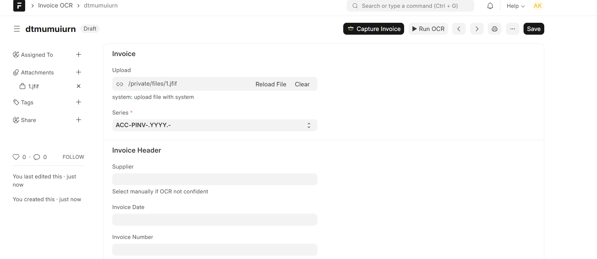
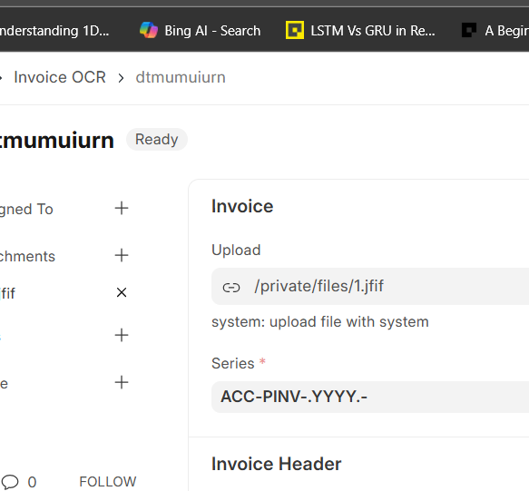
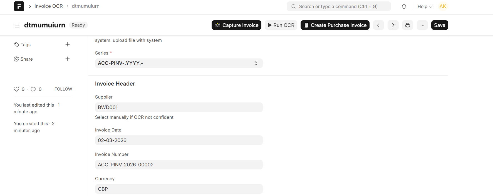
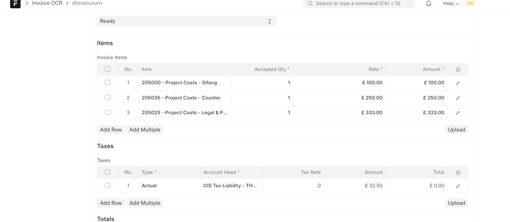
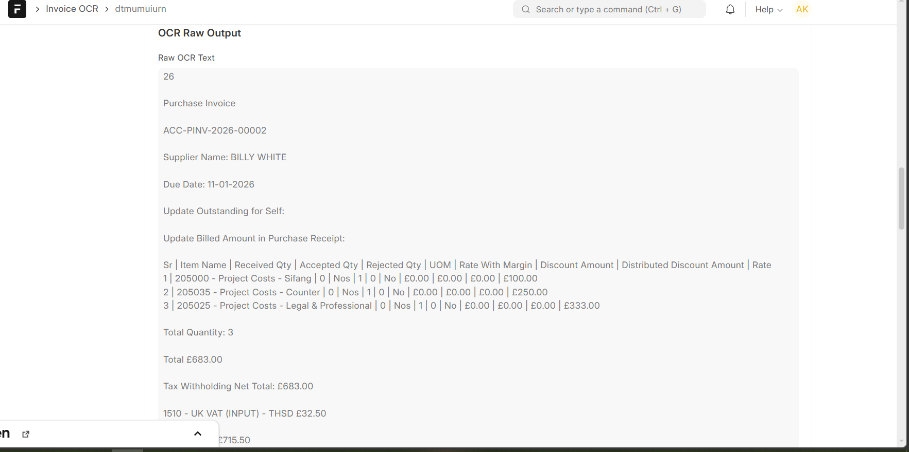
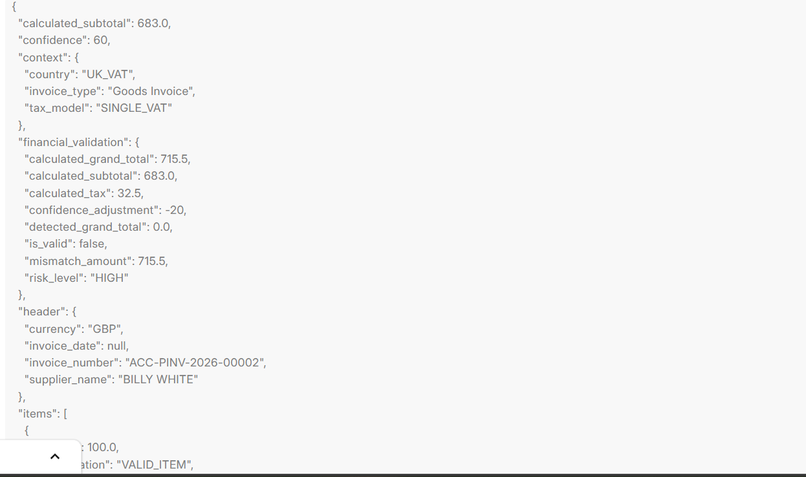
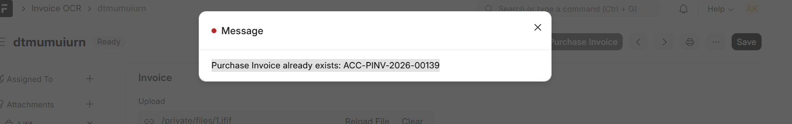
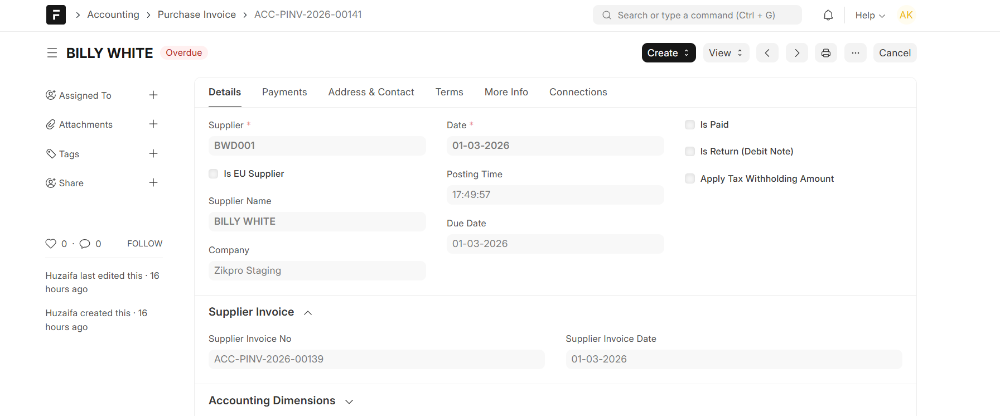
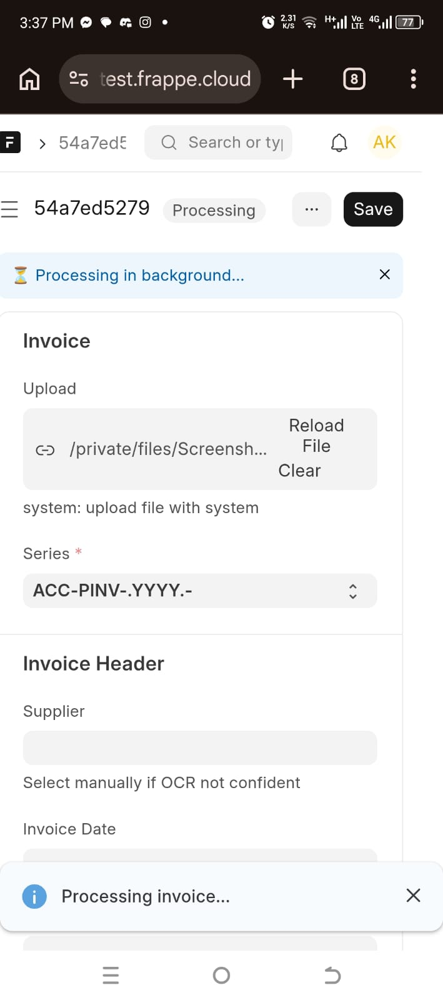
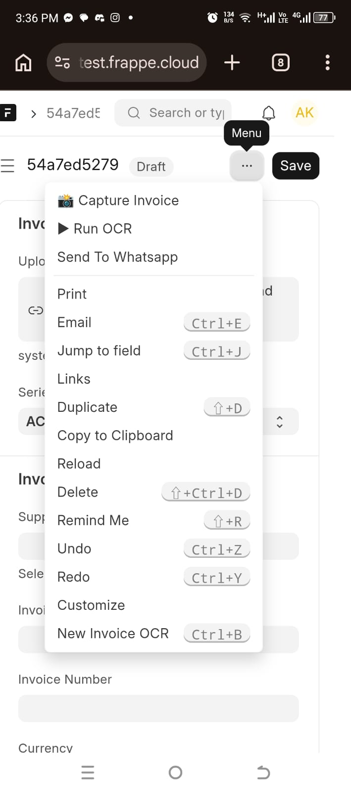

---

## 🔒 Security

- No API keys stored in source code
- API key stored securely using Frappe Password field
- Private file storage
- Background job isolation
- Error logging for audit purposes

---

## 📄 License

MIT

